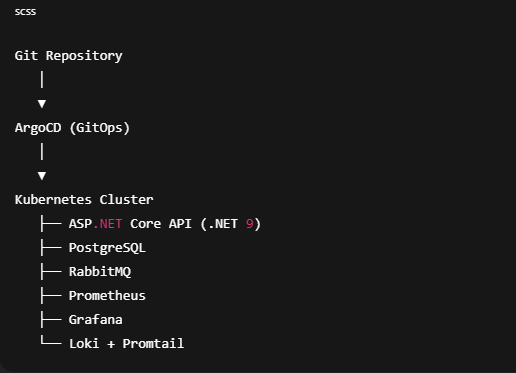
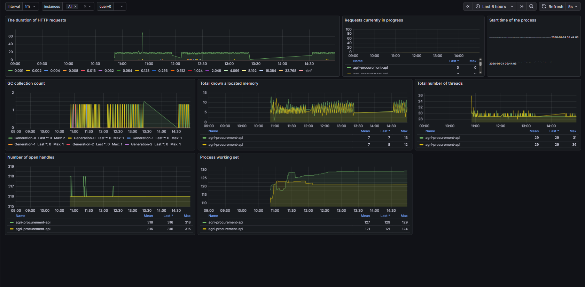
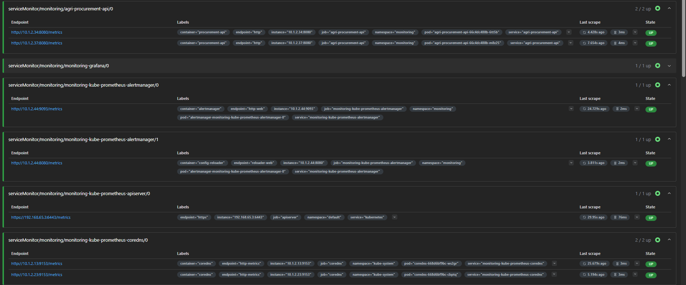
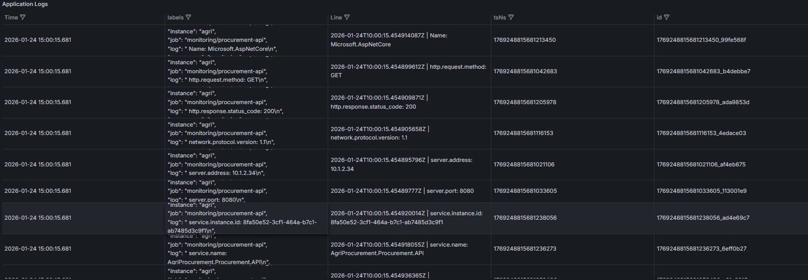
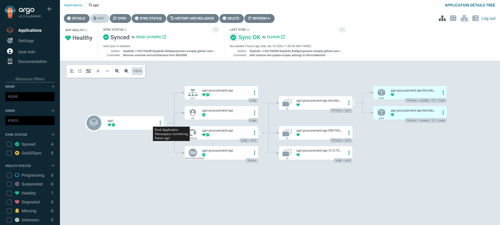
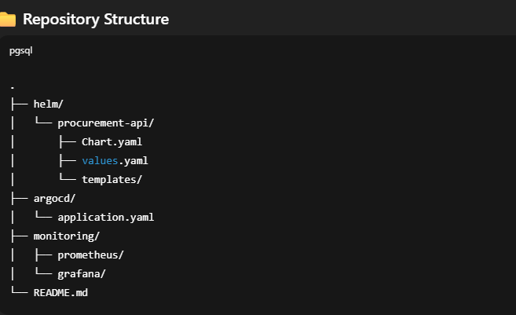

# 🌾 AgriProcurement Platform - Qishloq Xo'jaligi Xaridlari Tizimi

## 📌 Loyiha Haqida

AgriProcurement - bu qishloq xo'jaligi mahsulotlarini xarid qilish uchun mo'ljallangan zamonaviy mikroservis arxitekturasiga asoslangan platforma. Loyiha Clean Architecture tamoyillariga amal qilgan holda .NET 9 va ASP.NET Core yordamida ishlab chiqilgan.

## 🏗️ Tizim Arxitekturasi



Tizim quyidagi asosiy komponentlardan iborat:
- **API Gateway** - barcha so'rovlarni marshrutlash
- **Procurement Service** - xaridlar boshqaruvi
- **Supplier Service** - yetkazib beruvchilar boshqaruvi
- **RabbitMQ** - asinxron xabarlar almashish
- **PostgreSQL** - ma'lumotlar bazasi

## 🛠️ Texnologiyalar

### Backend
- **.NET 9** - asosiy framework
- **ASP.NET Core** - web API
- **Entity Framework Core** - ORM
- **MediatR** - CQRS pattern
- **RabbitMQ** - message broker
- **PostgreSQL** - ma'lumotlar bazasi
- **Serilog** - logging
- **OpenTelemetry** - monitoring
- **Prometheus** - metrics collection

### DevOps va Infrastructure
- **Docker** - konteynerizatsiya
- **Kubernetes** - orkestrlash
- **Helm** - Kubernetes package manager
- **ArgoCD** - GitOps deployment
- **Grafana** - monitoring dashboard
- **Loki** - log aggregation

## 📁 Loyiha Tuzilishi

```
AgriProcurement/
├── src/
│   ├── ApiGateway/                    # API Gateway
│   ├── BuildingBlocks/                # Umumiy kutubxonalar
│   └── Modules/
│       ├── Procurement/               # Xaridlar moduli
│       │   ├── Domain/               # Domain layer
│       │   ├── Application/          # Application layer
│       │   ├── Infrastructure/       # Infrastructure layer
│       │   └── API/                  # Presentation layer
│       └── Supplier/                  # Yetkazib beruvchilar moduli
│           ├── Domain/
│           ├── Application/
│           ├── Infrastructure/
│           └── API/
├── deploy/
│   └── helm/                         # Helm charts
└── tests/                            # Test loyihalari
```

## 🚀 Deployment Workflow

1. **Application** Helm orqali package qilinadi
2. **Helm charts** Git repository'da saqlanadi
3. **ArgoCD** repository o'zgarishlarini kuzatadi
4. **Kubernetes resources** avtomatik sinxronlanadi
5. **Application pods** cluster'ga deploy qilinadi
6. **Prometheus** /metrics endpoint'dan metrikalar to'playdi
7. **Grafana** metrikalar va loglarni vizualizatsiya qiladi
8. **Loki** Promtail orqali loglarni to'playdi

## 🚀 Loyihani Ishga Tushirish

### Talablar
- .NET 9 SDK
- Docker Desktop
- PostgreSQL
- RabbitMQ

### Lokal Ishga Tushirish

1. **Repository ni klonlash:**
```bash
git clone <repository-url>
cd AgriProcurement
```

2. **Ma'lumotlar bazasini sozlash:**
```bash
# PostgreSQL ishga tushirish
docker run --name postgres -e POSTGRES_PASSWORD=password -p 5432:5432 -d postgres

# Migration qo'llash
dotnet ef database update --project AgriProcurement.Procurement.Infrastructure
```

3. **RabbitMQ ishga tushirish:**
```bash
docker run -d --name rabbitmq -p 5672:5672 -p 15672:15672 rabbitmq:3-management
```

4. **Loyihani ishga tushirish:**
```bash
# Procurement API
dotnet run --project AgriProcurement.Procurement.API

# Supplier API
dotnet run --project AgriProcurement.Supplier.API

# API Gateway
dotnet run --project ApiGateway
```

## 📊 Monitoring va Logging

### Prometheus Metrics


**To'plangan Metrikalar:**
- HTTP so'rovlar davomiyligi
- So'rovlar soni status kodlari bo'yicha
- CPU va xotira ishlatilishi
- .NET GC metrikalari
- Thread count

### Grafana Dashboard


**Dashboardlar:**
- Kubernetes Cluster Overview
- Application Metrics Dashboard
- Node Exporter Metrics

### Loki Logging


**Logging xususiyatlari:**
- Barcha application podlardan loglar to'planadi
- Loki orqali markazlashtirilgan log saqlash
- Grafana'da loglarni vizualizatsiya
- Namespace bo'yicha filtrlash
- Pod va container bo'yicha filtrlash
- Log level bo'yicha qidirish (INFO/WARN/ERROR)

## 🔄 GitOps va Deployment

### ArgoCD


**ArgoCD vazifalari:**
- Git va cluster o'rtasida doimiy sinxronizatsiya
- Deklarativ Kubernetes deploymentlar
- Drift detection va self-healing
- Git history orqali rollback

**Asosiy afzalliklar:**
- Yagona haqiqat manbai (Git)
- Avtomatik deploymentlar
- Xavfsiz va audit qilinadigan o'zgarishlar



## 🏛️ Arxitektura Tamoyillari

### Clean Architecture
- **Domain Layer**: Business logic va entities
- **Application Layer**: Use cases va CQRS commands/queries
- **Infrastructure Layer**: Ma'lumotlar bazasi, messaging, external services
- **Presentation Layer**: API controllers va DTOs

### Design Patterns
- **CQRS** - Command Query Responsibility Segregation
- **Mediator Pattern** - MediatR orqali
- **Repository Pattern** - Ma'lumotlar bazasi abstraction
- **Unit of Work** - Transaction management
- **Domain Events** - Domain-driven design
- **Saga Pattern** - Distributed transactions

## 🔧 Xususiyatlar

### Procurement Service
- Xarid buyurtmalarini yaratish va boshqarish
- Idempotency support
- Rate limiting
- Correlation ID tracking
- Domain events

### Supplier Service
- Yetkazib beruvchilar ma'lumotlarini boshqarish
- Supplier reservation
- Event-driven communication

### Cross-cutting Concerns
- **Exception Handling** - Global exception middleware
- **Logging** - Structured logging with Serilog
- **Monitoring** - OpenTelemetry va Prometheus
- **Health Checks** - Application health monitoring
- **Rate Limiting** - API rate limiting
- **Correlation ID** - Request tracking

## 🧪 Testing

Loyihada quyidagi test turlari qo'llaniladi:
- Unit Tests
- Integration Tests
- API Tests
- Performance Tests

## 📚 API Documentation

Swagger UI orqali API documentation mavjud:
- Development: `http://localhost:5000`
- Swagger JSON: `http://localhost:5000/swagger/v1/swagger.json`

## 🔐 Xavfsizlik

- **Idempotency Keys** - POST so'rovlar uchun
- **Rate Limiting** - API abuse prevention
- **Input Validation** - Ma'lumotlar validatsiyasi
- **Exception Handling** - Xavfsiz error handling

## 🚀 Production Deployment

### Kubernetes
```bash
# Helm chart o'rnatish
helm install procurement-api ./deploy/helm/procurement-api
helm install supplier-api ./deploy/helm/supplier-api
```

### Docker
```bash
# Image build qilish
docker build -t agriprocurement-api .

# Container ishga tushirish
docker run -p 8080:80 agriprocurement-api
```

## 🤝 Hissa Qo'shish

1. Repository'ni fork qiling
2. Feature branch yarating (`git checkout -b feature/AmazingFeature`)
3. O'zgarishlarni commit qiling (`git commit -m 'Add some AmazingFeature'`)
4. Branch'ni push qiling (`git push origin feature/AmazingFeature`)
5. Pull Request oching

## 📄 Litsenziya

Bu loyiha MIT litsenziyasi ostida tarqatiladi. Batafsil ma'lumot uchun `LICENSE` faylini ko'ring.

## 👨‍💻 Muallif

**DevOps Engineer**
- Kubernetes, GitOps, Monitoring, Cloud-Native Infrastructure bo'yicha mutaxassis
- Zamonaviy DevOps amaliyotlari va vositalarini namoyish etish maqsadida yaratilgan

## 📞 Aloqa

Savollar yoki takliflar uchun issue yarating yoki pull request yuboring.

---

**Eslatma:** Bu loyiha ta'lim va namoyish maqsadlarida yaratilgan bo'lib, real dunyo DevOps amaliyotlari va vositalarini ko'rsatadi.
